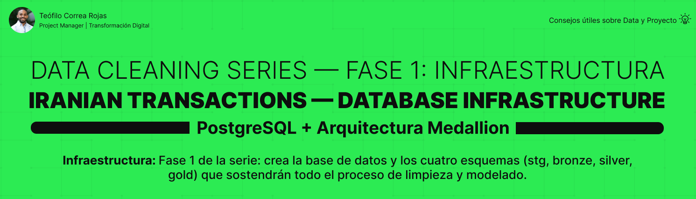

# Iranian Transactions — Database Infrastructure



## 📌 Descripción

Primera fase de una serie de limpieza de datos en PostgreSQL usando el
**Dirty Iranian Transactions Dataset** (Kaggle). Este proyecto establece
los cimientos: crea la base de datos y la estructura de cuatro esquemas
siguiendo la **arquitectura Medallion**, sobre la que se construirán las
fases de carga, limpieza y modelado dimensional.

> ℹ️ Dataset de práctica de Kaggle. Los datos son sintéticos y se usan
> con fines educativos.

---

## 🎯 Objetivos del proyecto

- Validar el estado del entorno antes de crear (base y esquemas)
- Crear la base de datos `iranian_transactions_db`
- Establecer los cuatro esquemas de la arquitectura Medallion
- Documentar los cimientos del proyecto para las fases siguientes

---

## 🏗️ Arquitectura Medallion

```
iranian_transactions_db
│
├── stg → datos crudos (staging), todo TEXT
├── bronze → auditoría, datos crudos + metadatos
├── silver → datos limpios, tipados y validados
└── gold → modelo dimensional Star Schema
```


Cada esquema representa una capa de refinamiento progresivo: los datos
entran crudos por `stg` y salen listos para análisis en `gold`.

| Esquema | Capa | Rol |
|---|---|---|
| `stg` | Staging | Datos crudos tal cual llegan del CSV |
| `bronze` | Bronce | Copia con metadatos de auditoría |
| `silver` | Plata | Datos limpios, tipados, validados |
| `gold` | Oro | Modelo dimensional para análisis |

---

## 📊 Sobre el dataset

El **Dirty Iranian Transactions Dataset** contiene transacciones
financieras con inconsistencias intencionales para practicar limpieza:
variantes de texto (`fail`/`FAIL`/`failed`), valores nulos disfrazados
(`nan`), y montos imposibles (`-999999`, negativos). El archivo de
trabajo tiene 6 columnas:

| Columna | Descripción |
|---|---|
| `status` | Estado de la transacción |
| `time` | Fecha y hora |
| `card_type` | Tipo de tarjeta |
| `city` | Ciudad |
| `amount` | Monto |
| `id` | Identificador |

---

## 💡 Decisiones clave de esta fase

| Decisión | Razón |
|---|---|
| Validar antes de crear | Confirmar el estado del entorno evita errores de duplicado |
| `pg_database` para la base | DATABASE no admite `IF NOT EXISTS` en PostgreSQL |
| `IF NOT EXISTS` para esquemas | SCHEMA sí lo admite; hace el script re-ejecutable |
| Cuatro esquemas separados | Aísla cada capa del refinamiento (Medallion) |

---

## 🧱 Estructura del proyecto
Cada esquema representa una capa de refinamiento progresivo: los datos
entran crudos por `stg` y salen listos para análisis en `gold`.

| Esquema | Capa | Rol |
|---|---|---|
| `stg` | Staging | Datos crudos tal cual llegan del CSV |
| `bronze` | Bronce | Copia con metadatos de auditoría |
| `silver` | Plata | Datos limpios, tipados, validados |
| `gold` | Oro | Modelo dimensional para análisis |

---

## 📊 Sobre el dataset

El **Dirty Iranian Transactions Dataset** contiene transacciones
financieras con inconsistencias intencionales para practicar limpieza:
variantes de texto (`fail`/`FAIL`/`failed`), valores nulos disfrazados
(`nan`), y montos imposibles (`-999999`, negativos). El archivo de
trabajo tiene 6 columnas:

| Columna | Descripción |
|---|---|
| `status` | Estado de la transacción |
| `time` | Fecha y hora |
| `card_type` | Tipo de tarjeta |
| `city` | Ciudad |
| `amount` | Monto |
| `id` | Identificador |

---

## 💡 Decisiones clave de esta fase

| Decisión | Razón |
|---|---|
| Validar antes de crear | Confirmar el estado del entorno evita errores de duplicado |
| `pg_database` para la base | DATABASE no admite `IF NOT EXISTS` en PostgreSQL |
| `IF NOT EXISTS` para esquemas | SCHEMA sí lo admite; hace el script re-ejecutable |
| Cuatro esquemas separados | Aísla cada capa del refinamiento (Medallion) |

---

## 🧱 Estructura del proyecto

```
IranianTransactions_Database_Infrastructure/
│
├── asset/
│ └── banner_infrastructure.png
│
├── docs/
│ └── project_closure.md
│
├── sql/
│ └── 00_infrastructure/
│ ├── validation/
│ │ ├── 01_check_database.sql
│ │ └── 02_check_schemas.sql
│ ├── 01_create_database.sql
│ ├── 02_create_schemas.sql
│ └── README.md
│
├── .gitignore
└── README.md
```

---

## 🚀 Cómo usar

```
1.Ejecutar validation/01_check_database.sql
→ verificar que la base no exista ya
2.Ejecutar 01_create_database.sql
→ crear iranian_transactions_db
3.Conectarse a la nueva base
4.Ejecutar validation/02_check_schemas.sql
→ revisar qué esquemas existen
5.Ejecutar 02_create_schemas.sql
→ crear stg, bronze, silver, gold
```

---

## 🔜 Fases del proyecto

| Fase | Proyecto | Enfoque |
|---|---|---|
| 1 | IranianTransactions_Database_Infrastructure | Infraestructura ← estás aquí |
| 2 | IranianTransactions_STG_Layer | Datos crudos |
| 3 | IranianTransactions_Bronze_Layer | Auditoría |
| 4 | IranianTransactions_Silver_Layer | Limpieza + columnas calculadas |
| 5 | IranianTransactions_Gold_Layer | Modelo dimensional + window functions |

---

## 👤 Autor

### Teófilo Correa Rojas

**Project Manager | Data analytic**

🔗 [LinkedIn](https://www.linkedin.com/in/teófilo-correa-rojas/)